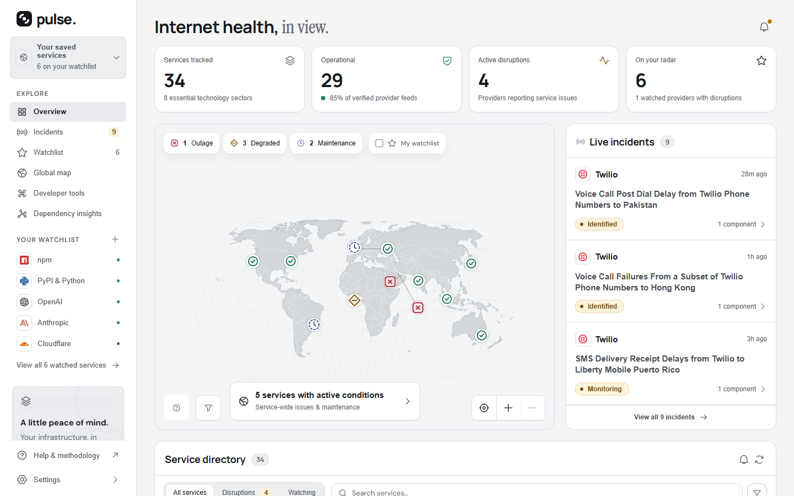
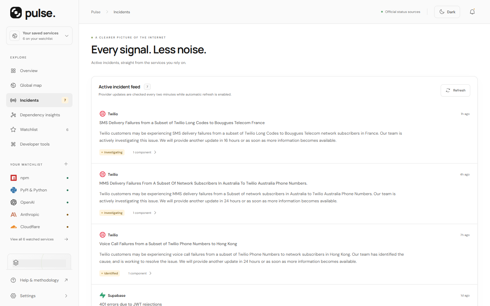
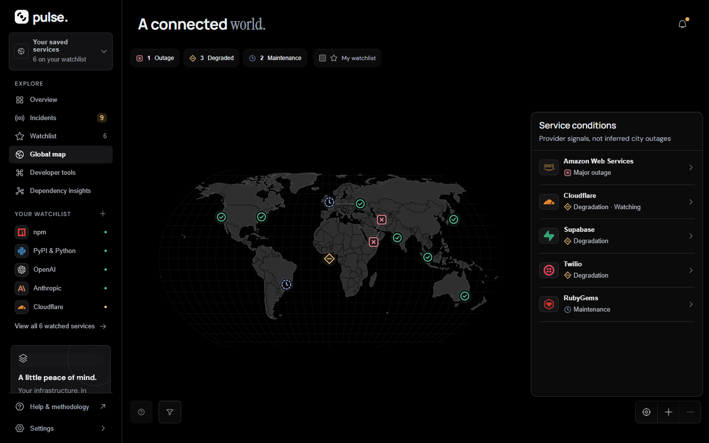
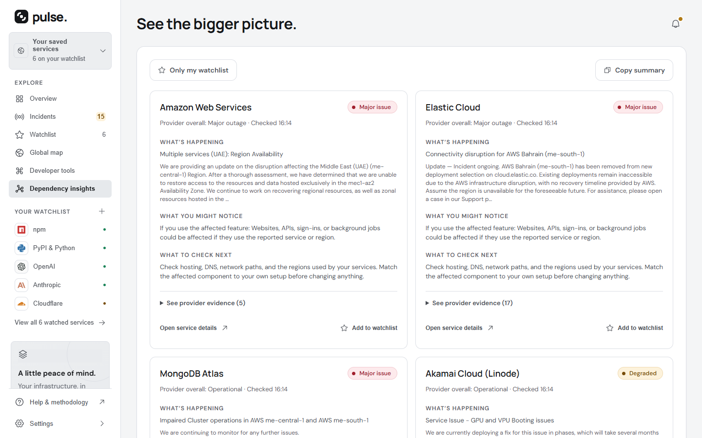

<div align="center">

<picture>
  <source media="(prefers-color-scheme: dark)" srcset="public/brand/pulse-symbol-white.svg">
  
</picture>
<h1>Pulse</h1>
<p>A calm, modern view of the internet's health.</p>

<p>
  <a href="https://github.com/haroontrailblazer/Pulse/actions/workflows/ci.yml"></a>
  <a href="./LICENSE"></a>
  <a href="https://github.com/haroontrailblazer/Pulse/releases/latest"></a>
  
  
</p>

<p>
  <a href="https://www.pulses4u.in">Website</a> &middot;
  <a href="https://www.pulses4u.in/app">Dashboard</a> &middot;
  <a href="https://www.pulses4u.in/#download">Download</a> &middot;
  <a href="#documentation">Docs</a>
</p>



</div>

Pulse aggregates the status feeds that 34 technology providers publish themselves, across eight categories, and presents them as one readable picture: overview counts, a live incident feed, a world map of affected regions, and a searchable service directory. It reports **provider-published health only** — never independent probes, synthetic checks, or inferred uptime. When a feed fails, times out, or changes format, Pulse marks that provider **unavailable** rather than assuming it is healthy. Pulse is independent of every company it lists and implies no endorsement.

One codebase ships three ways: the hosted website, a portable Windows EXE, and an Android APK.

## Download

| Surface | Artifact | Notes |
| --- | --- | --- |
| **Windows** | Portable `.exe` | No installer, no admin rights. Run the file; it serves itself on `127.0.0.1:47823`. |
| **Android** | `.apk` | Sideload. Android 7.0 / API 24 and above. |
| **Web** | — | Open [the dashboard](https://www.pulses4u.in/app) in a browser. Nothing to install. |

Installers: [pulses4u.in/#download](https://www.pulses4u.in/#download) &middot; [GitHub releases](https://github.com/haroontrailblazer/Pulse/releases)

Each release publishes SHA-256 digests for both installers, at [`SHA256SUMS.txt`](https://github.com/haroontrailblazer/Pulse/releases/latest) and in [`shared/release-assets.json`](shared/release-assets.json). Verify before running.

Two things stated plainly: **the Windows EXE is unsigned** — Windows SmartScreen will warn you — and **the APK is debug-signed**, not release-signed. Code-signing certificates are not configured for this project. Check the digests.

## Features

| | |
| --- | --- |
| **Official feeds only** | Statuspage-compatible feeds, Google Cloud's incident JSON, Azure's RSS, the AWS Health Dashboard, and Hugging Face through Better Stack. |
| **Overview** | Provider health counts, live incidents, and a filterable service directory across eight categories. |
| **Global map** | Regional pins coloured by fresh component status, with the source evidence behind each one. Provider-wide incidents never invent city outages. |
| **Incident inbox** | Active incidents sorted by newest source update, with local read state, impact badges, and watchlist scoping. |
| **Dependency insights** | What is happening, what a reader might notice, and what to check next — with the evidence and a copyable summary. |
| **Registries view** | Package installation, publishing, container services, and registry health as their own workspace. |
| **Security lab** | Live OSV advisory lookup, local JWT inspection, and local SHA-256 hashing with checksum comparison. |
| **Developer console** | Watched-stack health, feed diagnostics, JSON snapshots, and copyable source `curl` commands. |
| **Watchlist and alerts** | Stored on the device. Background checks on Windows and Android, plus a resizable Android home-screen widget. |
| **Interface** | Light and dark themes from shared tokens, a responsive phone layout, keyboard-accessible dialogs, reduced-motion support, and bundled fonts. |

## Quickstart

Requires Node.js 22.12+ (developed with Node 24).

```bash
npm ci
npm run dev
```

Open <http://localhost:5173>. The development server includes the status API.

For a production build:

```bash
npm run build
npm start
```

Open <http://localhost:3000>. The production server serves both `dist` and `/api/status`. On Windows PowerShell with a restricted execution policy, call `npm.cmd` in place of `npm`. Building the Windows EXE and the Android APK is covered in [docs/building.md](docs/building.md).

## Screens

| | | |
| --- | --- | --- |
|  |  |  |
| Incident inbox | Global map | Dependency insights |

## Documentation

Everything below, grouped and introduced, is in the [documentation index](docs/README.md).

| Document | What it covers |
| --- | --- |
| [docs/data-boundaries.md](docs/data-boundaries.md) | What Pulse measures, what it deliberately does not, and how each feed is read. |
| [docs/monitoring-api.md](docs/monitoring-api.md) | `/api/status`, the SSE stream, and sweep scheduling. |
| [docs/building.md](docs/building.md) | Building the Windows EXE and the Android APK, and the release harness. |
| [docs/deployment.md](docs/deployment.md) | The public website, Vercel, and the versioned download CDN. |
| [docs/navigation.md](docs/navigation.md) | Routes, history entries, and the back gesture on all three surfaces. |
| [docs/updates.md](docs/updates.md) | Daily update notices and in-app installs on the APK and the EXE. |
| [docs/interface.md](docs/interface.md) | Alerts, the widget, the incident inbox, the map, and the phone layout. |
| [docs/security-utilities.md](docs/security-utilities.md) | OSV lookups, JWT inspection, and local hashing — and their limits. |
| [design/README.md](design/README.md) | The logo, the brand assets, and how to regenerate them. |
| [design/design-system.md](design/design-system.md) | One visual language across the website, the APK, and the EXE. |
| [design/background-monitoring.md](design/background-monitoring.md) | The request-budget calculation and background scheduling. |
| [design/marketing-assets.md](design/marketing-assets.md) | Landing-page artwork and screenshot provenance. |
| [AGENTS.md](AGENTS.md) | The three-surface release sequence. Required reading before cutting a release. |
| [VERIFICATION.md](VERIFICATION.md) | Device-verification notes. |

## Project structure

```text
src/                 Shared interface, map, styles, and brand assets
shared/providers.js  Catalog and provider response normalization
shared/monitor.js    Refresh scheduling, freshness, and observed changes
server/              Official-feed aggregator, SSE API, and production web server
desktop/             Sandboxed Electron application
android/             Generated Capacitor Android project
scripts/             Build, packaging, release-harness, and QA tooling
tests/               Data integrity and production server tests
docs/                Reference documentation
design/              Brand and design-system notes
```

## Contributing

Issues and pull requests are welcome. [CONTRIBUTING.md](CONTRIBUTING.md) covers the local setup and the checks a change is expected to pass. Anything touching application, native, shared, or build code is a three-surface change — read [AGENTS.md](AGENTS.md) before opening it. Participation is governed by the [Code of Conduct](CODE_OF_CONDUCT.md).

## Security

Please do not open a public issue for a vulnerability. [SECURITY.md](SECURITY.md) explains how to report one privately and what is in scope. Signing keys and keystores never belong in the repository.

## License

Licensed under the Apache License, Version 2.0 — see [LICENSE](./LICENSE) and [NOTICE](./NOTICE). Copyright 2026 Haroon K M.

Apache-2.0 grants no rights in the Pulse name or the Pulse mark. Those remain trademarks of the copyright holder and are not licensed with the source.

## Acknowledgements

Map geometry is public-domain Natural Earth data, redistributed as TopoJSON by the [`world-atlas`](https://github.com/topojson/world-atlas) package (ISC). Icons are [Phosphor](https://github.com/phosphor-icons/react) (MIT) with selected [Simple Icons](https://github.com/simple-icons/simple-icons) paths (CC0). DM Sans and Manrope are bundled through Fontsource under the SIL Open Font License; the licence texts are in [`public/font-licenses/`](public/font-licenses/).

Provider names and marks belong to their respective owners and identify official sources. OpenAI's mark is rendered monochrome in accordance with its [brand guidance](https://openai.com/brand/). Pulse is independent of every company it lists, and none of these marks imply endorsement. The full attribution text is in [NOTICE](./NOTICE).
